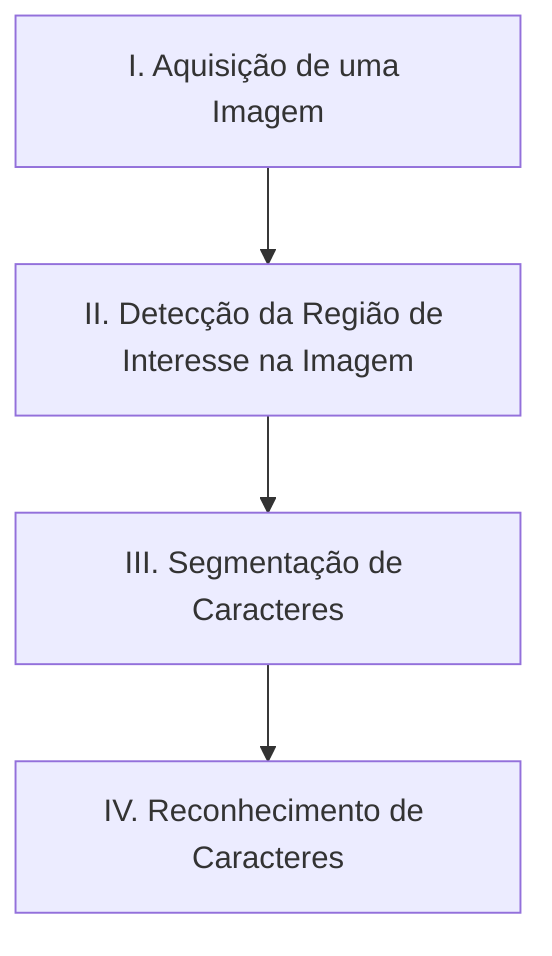

A [Gabriel](https://gabriel.com.br/) é uma empresa brasileira, focada em devolver o direito às ruas para todas e todos os brasileiros. Isto é feito através do desenvolvimento de tecnologia brasileira, utilizada para tornar as cidades mais inteligentes e justas. Através de uma rede própria de câmeras voltadas para as ruas, imagens e metadados são coletados, a fim de gerar mais inteligência para entregar mais segurança à toda sociedade.

Dentro do conjunto de metadados extraídos, estão as **placas veiculares**. Placas veiculares resultam da combinação de algoritmos de visão computacional que identificam, no vídeo extraído, a placa de um veículo, e extraem os caracteres presentes dessa placa. O processo pode ser simplificado pelas etapas abaixo:

> 📘 Info
>
> Todo esse processo é executado sobre a infraestrutura computacional das câmeras.

Pela natureza da operação da empresa, as câmeras são apontadas para as ruas à fim de contemplar o maior **campo de visão** possível. Para além, estas são instaladas em diferentes angulações e distâncias da rua, impactando a performance dos modelos de visão computacional envolvidos no processo. Por conta disso, é comum que a etapa **"IV. Reconhecimento de Caracteres"** cometa erros, devido à, principalmente, similaridade visual de caracteres específicos. Alguns exemplos são:

- Letra **A** - Número **4**;
- Letra **B** - Número **8**;
- Letra **O** - Número **0**;
- Letra **O** - Letra **D**.

Uma das estratégias para suplementar a má-performance destas inferências, é, de forma arbitrária, selecionar eventos de detecção para terem suas imagens recolhidas, e diagnosticadas através de algoritmos mais refinados. Abaixo, é possível acessar um recorte da base de dados com as seguintes características:
